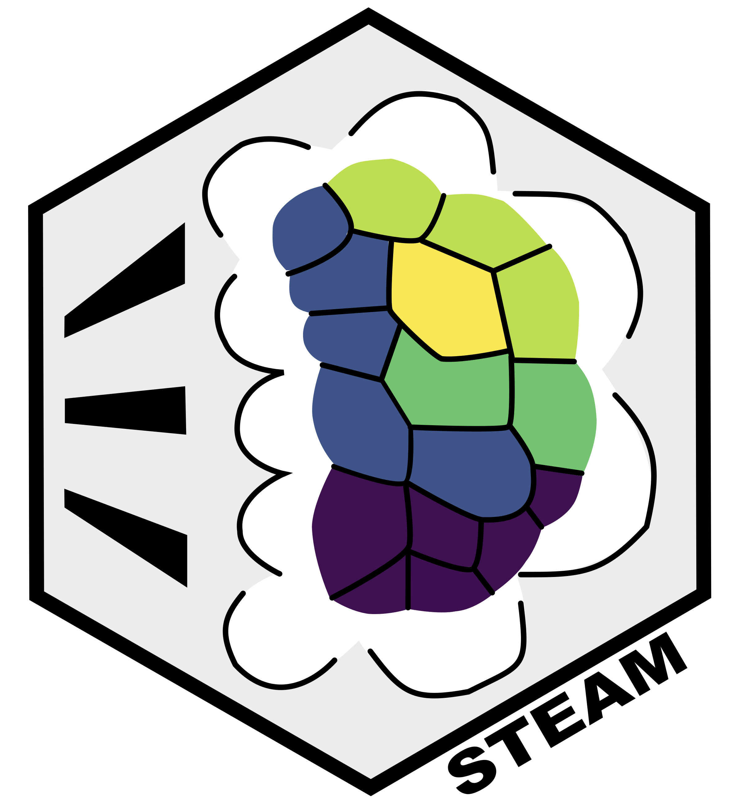
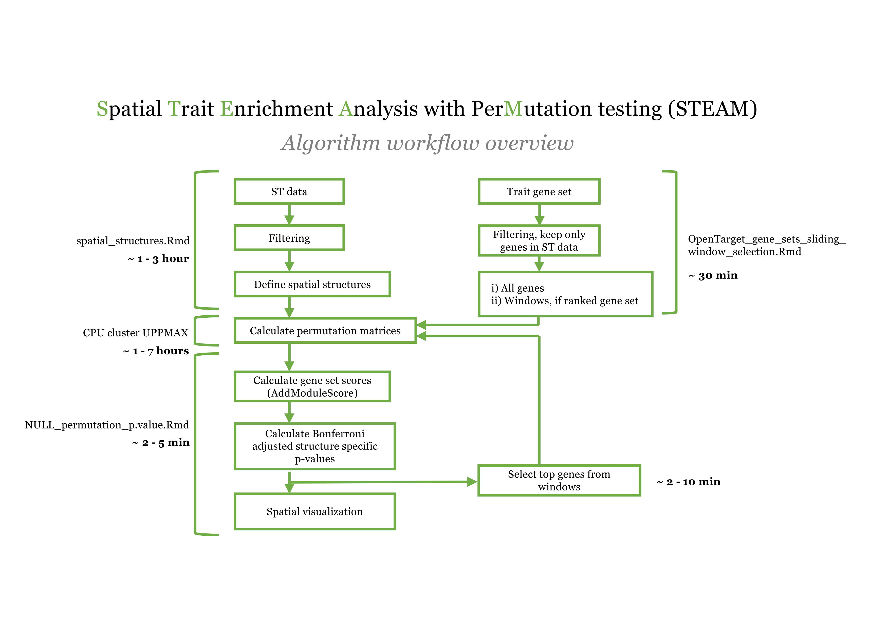

# STEAM 

 
   

STEAM is an algorithm for **S**patial **T**rait **E**nrichment **A**nalysis with per**M**utation testing, a robust computational approach to measure the enrichment of average gene expression across clusters in a dataset from a given gene list; it calculates a permutation p-value and performs multiple testing corrections based on the number of clusters. For ranked gene lists, STEAM enables interrogation of the topmost relevant sets of genes based on their combined average enrichment. 

We applied STEAM to spatially resolved transcriptomics (SRT) datasets to elucidate the genetic basis of complex traits and diseases. We analyzed 31 SRT datasets from humans and mice spanning 8 organs and 32 complex traits. We also applied STEAM to single-cell and single-nuclei RNAseq datasets from the mouse and human brain, highlighting the complementary insights from the two data types. Here, we will provide the source code and scripts for our manuscript upon peer-reviewed publication. The code for re-creating the manuscript figures is stored in their corresponding folders.

To install the latest STEAM R-package version, visit: https://github.com/NBISweden/steam

For STEAM R-package vignettes, visit: https://kvastad.github.io/STEAM/

